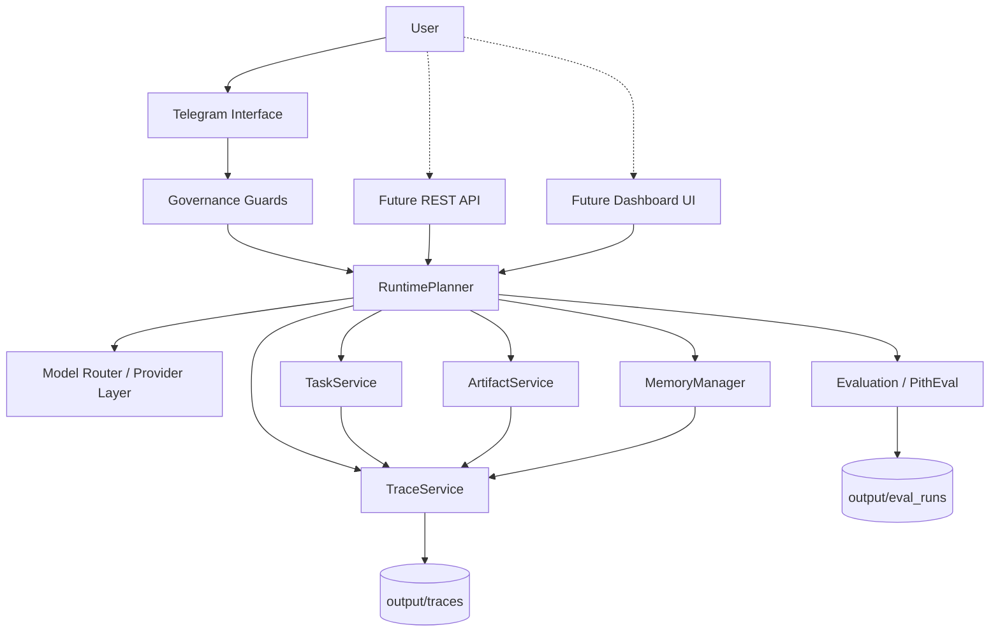
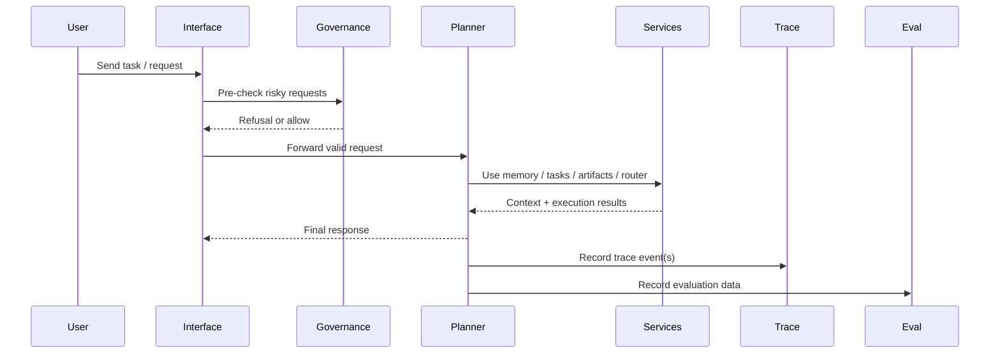

# PITH_SYSTEM_MAP_V1

## Purpose

This document defines the minimal runtime system map for Pith v5.2.
It is intended for internal observability, dashboard integration, and architectural alignment.

## System Map

## Request Flow

## Notes

- Telegram is the current primary interface, but not the final product surface.
- Dashboard UI and REST API are future interfaces over the same runtime core.
- Governance is enforced before risky execution paths.
- Trace and Evaluation form the observability spine of the system.
- `output/traces` and `output/eval_runs` are the current local evidence stores.